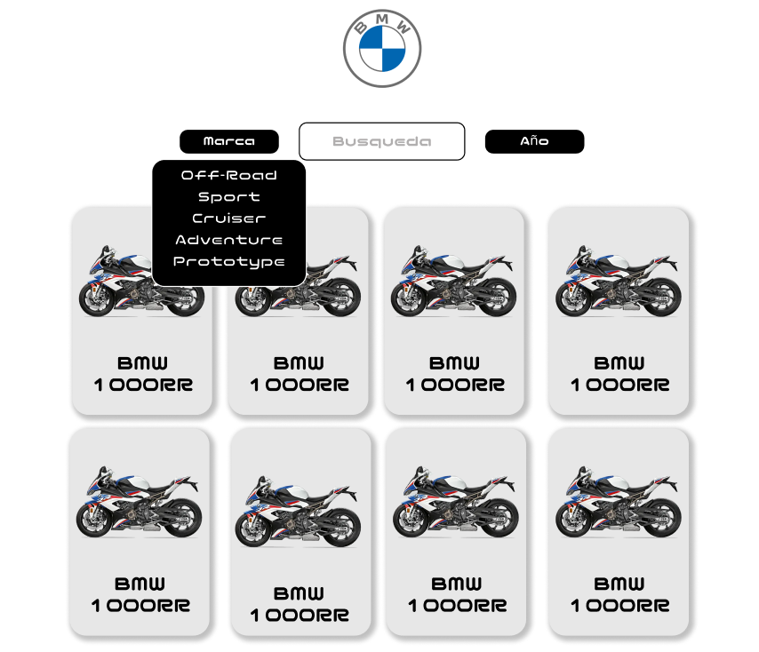
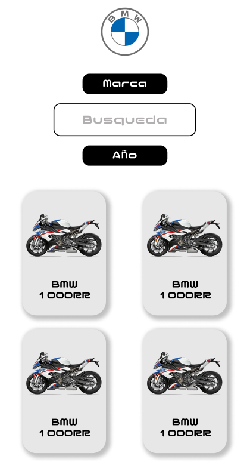
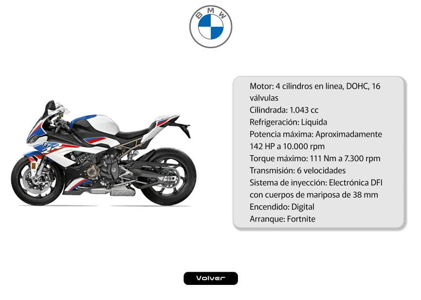
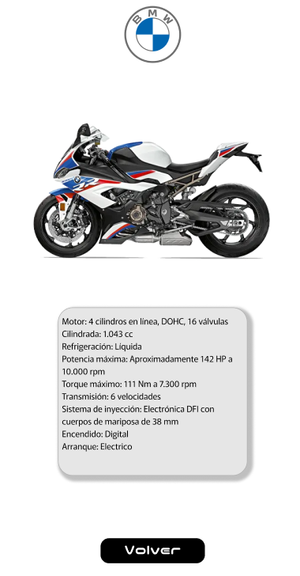

# BMW Motos - Sistema de Información


## 📌 Overview

Mediante esta pagina web, se podra acceder a la información suministrada por una API publica, la cual recolecta ciertos datos y especificaciones de motocicletas de distintas marcas. Para el caso de este proyecto se limito su rango de busqueda a la marca BMW. Por lo cual se podr observar la información relevante de cada modelo de motocicletas BMW contenidas en la API.

## 💻 Tecnología Usada

- HTML5
- JavaScript
- CSS
- Bootstrap
- Figma
- JSON

## 🔧 Datos Técnicos

### ´Prerrequisitos
- Navegador WEB actual
- Entendimiento Basico de tecnologias de programación

### Uso
1. Clona el repositorio:
   ```
   git clone https://github.com/Davisson-Adriel/BMW
   ```

2. Abre el archivo `index.html` en tu buscador de preferencia o usalo de manera local. Tambien se puede.

"Tambien se puede hacer uso directamente de GitHub mediante el siguiente enlace [BMW API](https://davisson-adriel.github.io/BMW/)"

## 📱 Diseño Responsivo

La aplicación maneja un sistema responsivo, el cual permite visualizar y hacer uso de la misma, desde dispositivos de computo hasta celulares.

## 📚 Maquetación

El proceso de maquetación se llevo a cabo mediante el uso de FIGMA. Como se puede observar algunos detalles visuales y funcionales fueron sustituido y/o anulados durante el procesos de codificación debido a diferentes factores. A continuación se muestra la maquetación realizada de las dos pestañas funcionales de la pagina Web, donde se puede observar su versión de escritorio y su versión movil.






## 🧑 Autor

DAVISSON ADRIEL ROMAN CARREÑO